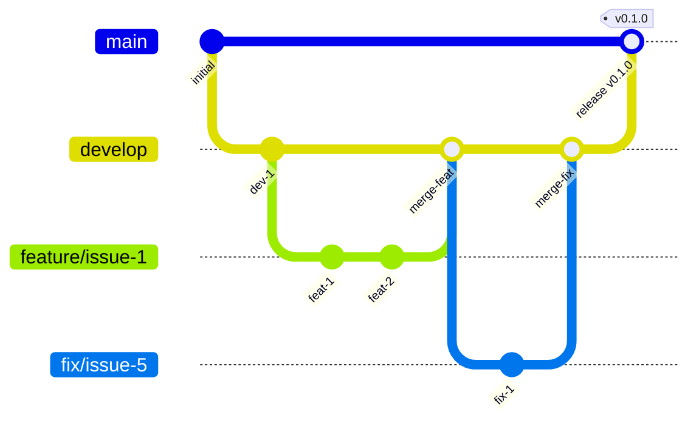

# Contributing to wagtail-reusable-blocks

Thank you for your interest in contributing!

## Development Setup

### Prerequisites

- Python 3.10+
- uv (recommended) or pip

### Clone and Setup

```bash
git clone https://github.com/kkm-horikawa/wagtail-reusable-blocks.git
cd wagtail-reusable-blocks

# Using uv (recommended)
uv venv
source .venv/bin/activate
uv pip install -e ".[dev]"

# Or using pip
python -m venv .venv
source .venv/bin/activate
pip install -e ".[dev]"
```

### Running Tests

```bash
pytest
```

### Code Style

```bash
# Format code
ruff format .

# Lint
ruff check .

# Type check
mypy src/
```

## Coding Standards

### Overview

| Item | Standard |
|------|----------|
| Formatter/Linter | [Ruff](https://docs.astral.sh/ruff/) |
| Line length | 88 characters |
| Quotes | Double quotes `"` |
| Type hints | Required for public APIs |
| Docstrings | Google style |

### Naming Conventions

| Type | Convention | Example |
|------|------------|---------|
| Class | PascalCase | `ReusableBlock`, `SlotPlaceholderBlock` |
| Function/Method | snake_case | `get_block`, `render_content` |
| Variable | snake_case | `block_id`, `slot_content` |
| Constant | UPPER_SNAKE_CASE | `MAX_NESTING_DEPTH`, `DEFAULT_TIMEOUT` |
| Private method | _leading_underscore | `_validate_slots` |

### Type Annotations

Required for:
- All function parameters and return types
- Public methods
- Complex variables

```python
def get_reusable_block(
    slug: str,
    include_drafts: bool = False,
) -> ReusableBlock | None:
    """Fetch a ReusableBlock by slug.

    Args:
        slug: The unique slug identifier.
        include_drafts: Whether to include unpublished blocks.

    Returns:
        The ReusableBlock instance, or None if not found.
    """
    queryset = ReusableBlock.objects.all()
    if not include_drafts:
        queryset = queryset.filter(is_published=True)
    return queryset.filter(slug=slug).first()
```

### Django Model Convention

```python
class ReusableBlock(models.Model):
    """A reusable content block.

    Attributes:
        name: Human-readable identifier.
        slug: URL-safe unique identifier.
        content: StreamField containing the block content.
    """

    # Constants
    MAX_NAME_LENGTH = 255

    # Fields
    name = models.CharField(max_length=MAX_NAME_LENGTH)
    slug = models.SlugField(unique=True)
    content = StreamField([...], use_json_field=True)
    created_at = models.DateTimeField(auto_now_add=True)
    updated_at = models.DateTimeField(auto_now=True)

    class Meta:
        ordering = ["-updated_at"]
        indexes = [
            models.Index(fields=["slug"]),
        ]

    def __str__(self) -> str:
        return self.name
```

### Import Order

```python
# 1. Standard library
from datetime import datetime
from typing import Any

# 2. Third-party packages
from django.db import models
from wagtail.fields import StreamField

# 3. Local imports
from wagtail_reusable_blocks.blocks import ReusableBlockChooserBlock
```

Ruff's isort will automatically organize imports.

### Testing Standards

#### Test Structure

```
tests/
├── conftest.py              # Shared fixtures
├── test_models.py           # Model tests
├── test_blocks.py           # Block tests
└── test_integration.py      # Integration tests
```

#### Test Naming

```python
class TestReusableBlock:
    """Tests for ReusableBlock model."""

    def test_create_with_valid_data(self):
        """ReusableBlock can be created with valid data."""
        ...

    def test_slug_must_be_unique(self):
        """Duplicate slugs raise IntegrityError."""
        ...

    def test_content_renders_correctly(self):
        """StreamField content renders as expected."""
        ...
```

Naming pattern: `test_<what>_<condition/expectation>`

#### Test Documentation

```python
def test_circular_reference_detection(self):
    """Circular references are detected and raise ValidationError.

    【Test Intent】
    Ensure the system prevents infinite loops when blocks reference each other.

    【What This Guarantees】
    - Block A → Block B → Block A is detected
    - Clear error message is provided
    - Save is prevented

    【Test Steps】
    1. Create Block A
    2. Create Block B referencing Block A
    3. Update Block A to reference Block B
    4. Verify ValidationError is raised

    【Expected Result】
    ValidationError with circular reference details
    """
    ...
```

#### What to Test

**Good tests:**
- Boundary values (0, max, max+1)
- Business logic
- Error handling
- Edge cases

**Skip these:**
- Simple getters/setters
- `__str__` methods (unless complex)
- Framework behavior (Django/Wagtail already tests this)

#### Fixtures (conftest.py)

```python
import pytest
from wagtail_reusable_blocks.models import ReusableBlock

@pytest.fixture
def sample_block():
    """Create a basic ReusableBlock for testing."""
    return ReusableBlock.objects.create(
        name="Test Block",
        slug="test-block",
        content=[{"type": "rich_text", "value": "<p>Test</p>"}],
    )

@pytest.fixture
def block_with_slots():
    """Create a ReusableBlock with slot placeholders."""
    return ReusableBlock.objects.create(
        name="Layout Block",
        slug="layout-block",
        content=[
            {"type": "slot", "value": {"slot_id": "main"}},
        ],
    )
```

#### Running Tests

```bash
# Run all tests
pytest

# Run with coverage
pytest --cov=wagtail_reusable_blocks --cov-report=html

# Run specific test file
pytest tests/test_models.py

# Run specific test
pytest tests/test_models.py::TestReusableBlock::test_create_with_valid_data
```

#### Coverage Target

- Overall: 90%+
- Models: 95%+
- Blocks: 90%+

## Project Structure

```
wagtail-reusable-blocks/
├── src/
│   └── wagtail_reusable_blocks/
│       ├── __init__.py
│       ├── models.py          # ReusableBlock model
│       ├── blocks.py          # StreamField blocks
│       ├── wagtail_hooks.py   # Admin integration
│       └── templates/
├── tests/
├── docs/
│   ├── ARCHITECTURE.md        # Design decisions
│   └── GLOSSARY.md            # Terminology
├── pyproject.toml
├── README.md
└── CONTRIBUTING.md
```

## Branch Strategy

We use a modified Git Flow strategy:



### Branch Types

| Branch | Purpose | Base | Merge To |
|--------|---------|------|----------|
| `main` | Production releases | - | - |
| `develop` | Development integration | `main` | `main` |
| `feature/*` | New features | `develop` | `develop` |
| `fix/*` | Bug fixes | `develop` | `develop` |
| `hotfix/*` | Urgent production fixes | `main` | `main` + `develop` |

### Branch Naming

```
feature/<issue-number>-<short-description>
fix/<issue-number>-<short-description>
hotfix/<issue-number>-<short-description>
```

Examples:
- `feature/1-reusable-block-model`
- `fix/12-circular-reference-detection`
- `hotfix/15-security-patch`

### Protected Branches

| Branch | Direct Push | PR Required | Delete Protection |
|--------|-------------|-------------|-------------------|
| `main` | No | Yes | Yes |
| `develop` | No | Yes | Yes |

## Development Workflow

### 1. Check Existing Issues

Before starting work, check the [Issue Tracker](https://github.com/kkm-horikawa/wagtail-reusable-blocks/issues) and [Project Board](https://github.com/users/kkm-horikawa/projects/6).

### 2. Create a Branch

```bash
# Start from develop
git checkout develop
git pull origin develop

# Create feature or fix branch
git checkout -b feature/<issue-number>-<description>
# or
git checkout -b fix/<issue-number>-<description>
```

### 3. Make Changes

- Write tests for new functionality
- Follow existing code style
- Update documentation if needed

### 4. Test Your Changes

```bash
pytest
ruff check .
ruff format --check .
```

### 5. Commit

Follow [Conventional Commits](https://www.conventionalcommits.org/):

```bash
git commit -m "feat: add ReusableBlockChooserBlock"
git commit -m "fix: resolve circular reference detection"
git commit -m "docs: update installation guide"
```

### 6. Push and Create PR

```bash
git push origin feature/<issue-number>-<description>
```

Then create a Pull Request **to `develop`** on GitHub.

### 7. Release Process

When ready to release:
1. Create PR from `develop` to `main`
2. After merge, tag the release: `git tag v0.x.0`
3. Push tag: `git push origin v0.x.0`

## Milestones and Roadmap

| Milestone | Focus |
|-----------|-------|
| [v0.1.0](https://github.com/kkm-horikawa/wagtail-reusable-blocks/milestone/1) | MVP - Basic reusable blocks |
| [v0.2.0](https://github.com/kkm-horikawa/wagtail-reusable-blocks/milestone/2) | Slot-based templating |
| [v0.3.0](https://github.com/kkm-horikawa/wagtail-reusable-blocks/milestone/3) | Performance & production ready |

## Key Documents

- [README.md](README.md) - Project overview and quick start
- [docs/ARCHITECTURE.md](docs/ARCHITECTURE.md) - Design decisions and why
- [docs/GLOSSARY.md](docs/GLOSSARY.md) - Terminology definitions

## Questions?

Open an [Issue](https://github.com/kkm-horikawa/wagtail-reusable-blocks/issues) for questions or discussions.
