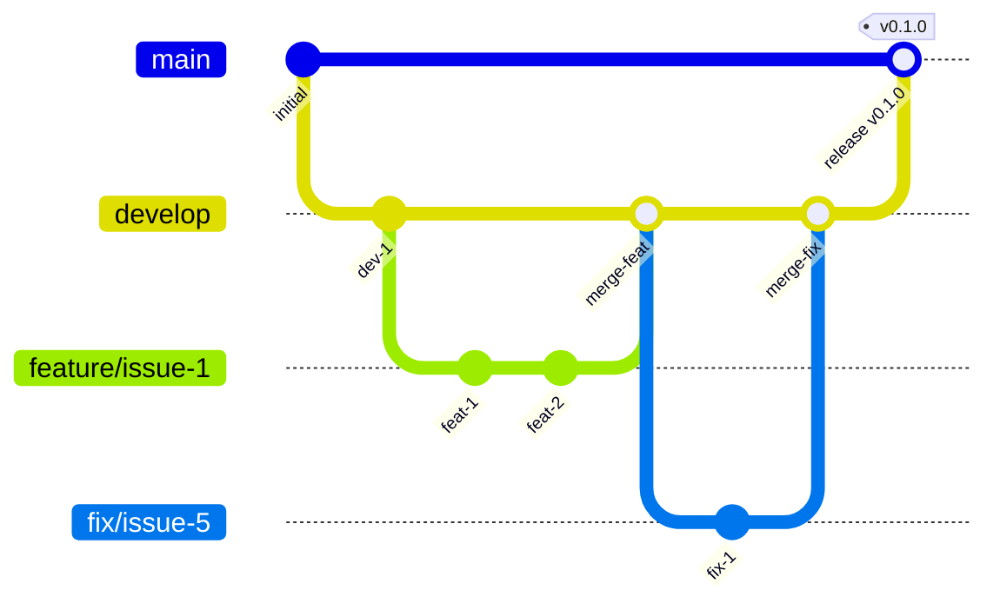

# Contributing to wagtail-reusable-blocks

Thank you for your interest in contributing!

## Development Setup

### Prerequisites

- Python 3.10+ (for basic development)
- **Python 3.10, 3.11, 3.12, 3.13, 3.14** (for full matrix testing with tox)
- **uv 0.9.0+** (recommended) or pip
  - For Python 3.14 support, uv 0.9.0 or later is required
  - Check version: `uv --version`
  - Update: `curl -LsSf https://astral.sh/uv/install.sh | sh`

#### Installing Multiple Python Versions

For full matrix testing, you'll need all supported Python versions installed.

**Using uv (recommended):**
```bash
# Install all supported Python versions
uv python install 3.10 3.11 3.12 3.13 3.14

# Verify installations
uv python list
```

> **Note:** Python 3.14 may be in alpha/beta during development. If you encounter stability issues with Python 3.14 tests (e.g., segmentation faults), this is expected for pre-release versions. The CI workflow tests against the stable release.

**Alternative: Using pyenv:**
```bash
# Install pyenv
curl https://pyenv.run | bash

# Install all supported Python versions
pyenv install 3.10.16
pyenv install 3.11.11
pyenv install 3.12.8
pyenv install 3.13.1
pyenv install 3.14.0

# Make them available globally
pyenv global 3.13.1 3.10.16 3.11.11 3.12.8 3.14.0
```

### Clone and Setup

```bash
git clone https://github.com/kkm-horikawa/wagtail-reusable-blocks.git
cd wagtail-reusable-blocks

# Using uv (recommended)
uv venv
source .venv/bin/activate
uv pip install -e ".[dev]"

# Or using pip
python -m venv .venv
source .venv/bin/activate
pip install -e ".[dev]"
```

> **Note:** We use `uv pip install` instead of `uv sync` because this is a **library project**.
> We don't commit `uv.lock` to maintain dependency flexibility for downstream users.
> See [Project Management](#project-management) for more details.

### Running Tests

```bash
pytest
```

### Running Matrix Tests Locally

To test against all supported Python/Django/Wagtail combinations (39 total):

```bash
# Install tox
uv pip install tox

# Run all 39 combinations
tox

# Test specific Python version (all Django/Wagtail combinations)
tox -e py314

# Test specific combination
tox -e py314-django52-wagtail72

# Run in parallel (faster)
tox -p auto

# Pass pytest arguments
tox -- -k test_specific

# List all available environments
tox -l
```

This matches the CI matrix exactly, allowing you to verify compatibility before pushing.

**Note:** Tox will create virtual environments for each combination. The first run will be slow, but subsequent runs are faster due to caching.

## Supported Versions

### Python Versions
- **3.10** (minimum)
- **3.11**
- **3.12**
- **3.13**
- **3.14** (latest)

### Django Versions
- **4.2** (LTS - Long Term Support until April 2026)
- **5.1**
- **5.2** (LTS - Long Term Support until April 2028)

### Wagtail Versions
- **5.2** (LTS - Long Term Support)
- **6.4**
- **7.0** (LTS - Long Term Support)
- **7.2** (latest)

## Version Compatibility Matrix

Our CI tests 39 valid combinations of Python, Django, and Wagtail versions.

### Compatibility Table

| Python | Django 4.2 | Django 5.1 | Django 5.2 |
|--------|------------|------------|------------|
| **Wagtail 5.2** ||||
| 3.10 | ✅ | ❌ | ❌ |
| 3.11 | ✅ | ❌ | ❌ |
| 3.12 | ✅ | ❌ | ❌ |
| 3.13 | ✅ | ❌ | ❌ |
| 3.14 | ❌ | ❌ | ❌ |
| **Wagtail 6.4** ||||
| 3.10 | ✅ | ✅ | ❌ |
| 3.11 | ✅ | ✅ | ✅ |
| 3.12 | ✅ | ✅ | ✅ |
| 3.13 | ✅ | ✅ | ✅ |
| 3.14 | ❌ | ❌ | ❌ |
| **Wagtail 7.0** ||||
| 3.10 | ✅ | ✅ | ❌ |
| 3.11 | ✅ | ✅ | ✅ |
| 3.12 | ✅ | ✅ | ✅ |
| 3.13 | ✅ | ✅ | ✅ |
| 3.14 | ❌ | ❌ | ❌ |
| **Wagtail 7.2** ||||
| 3.10 | ✅ | ✅ | ❌ |
| 3.11 | ✅ | ✅ | ✅ |
| 3.12 | ✅ | ✅ | ✅ |
| 3.13 | ✅ | ✅ | ✅ |
| 3.14 | ❌ | ❌ | ✅ |

**Summary:**
- **Total combinations**: 60 (5 Python × 3 Django × 4 Wagtail)
- **Valid combinations**: 39 (tested in CI)
- **Excluded combinations**: 21

### Exclusion Rationale

Certain combinations are excluded due to compatibility constraints:

1. **Python 3.10 + Django 5.2**: Django 5.2 requires Python 3.11+
2. **Wagtail 5.2 + Django 5.1/5.2**: Wagtail 5.2 only supports Django up to 4.2
3. **Python 3.14 + Django 4.2/5.1**: Python 3.14 is only supported by Django 5.2+
4. **Python 3.14 + Wagtail 5.2/6.4/7.0**: Python 3.14 is only supported by Wagtail 7.2+

These exclusions are based on official compatibility tables:
- [Django FAQ: Installation](https://docs.djangoproject.com/en/stable/faq/install/)
- [Wagtail Upgrading Guide](https://docs.wagtail.org/en/stable/releases/upgrading.html)

## Test Matrix Strategy

### CI Workflow
Our GitHub Actions CI tests all 39 valid combinations in parallel, ensuring compatibility across:
- All supported Python versions
- All supported Django versions
- All supported Wagtail versions

See `.github/workflows/ci.yml` for the complete matrix configuration.

### Local Testing with tox
Use `tox` to replicate the CI matrix locally before pushing:

```bash
# Test all 39 combinations
tox

# Test specific Python version
tox -e py314

# Test specific combination
tox -e py314-django52-wagtail72
```

### Why No `uv.lock`?

This is a **library project**, not an application. We intentionally don't commit `uv.lock` to:

- Allow downstream users to resolve dependencies based on their own constraints
- Maintain maximum compatibility across different environments
- Avoid forcing specific transitive dependency versions

Applications should use lock files for reproducible builds. Libraries should not.

### Code Style

```bash
# Format code
ruff format .

# Lint
ruff check .

# Type check
mypy src/
```

## Coding Standards

### Overview

| Item | Standard |
|------|----------|
| Formatter/Linter | [Ruff](https://docs.astral.sh/ruff/) |
| Line length | 88 characters |
| Quotes | Double quotes `"` |
| Type hints | Required for public APIs |
| Docstrings | Google style |

### Naming Conventions

| Type | Convention | Example |
|------|------------|---------|
| Class | PascalCase | `ReusableBlock`, `SlotPlaceholderBlock` |
| Function/Method | snake_case | `get_block`, `render_content` |
| Variable | snake_case | `block_id`, `slot_content` |
| Constant | UPPER_SNAKE_CASE | `MAX_NESTING_DEPTH`, `DEFAULT_TIMEOUT` |
| Private method | _leading_underscore | `_validate_slots` |

### Type Annotations

Required for:
- All function parameters and return types
- Public methods
- Complex variables

```python
def get_reusable_block(
    slug: str,
    include_drafts: bool = False,
) -> ReusableBlock | None:
    """Fetch a ReusableBlock by slug.

    Args:
        slug: The unique slug identifier.
        include_drafts: Whether to include unpublished blocks.

    Returns:
        The ReusableBlock instance, or None if not found.
    """
    queryset = ReusableBlock.objects.all()
    if not include_drafts:
        queryset = queryset.filter(is_published=True)
    return queryset.filter(slug=slug).first()
```

### Django Model Convention

```python
class ReusableBlock(models.Model):
    """A reusable content block.

    Attributes:
        name: Human-readable identifier.
        slug: URL-safe unique identifier.
        content: StreamField containing the block content.
    """

    # Constants
    MAX_NAME_LENGTH = 255

    # Fields
    name = models.CharField(max_length=MAX_NAME_LENGTH)
    slug = models.SlugField(unique=True)
    content = StreamField([...], use_json_field=True)
    created_at = models.DateTimeField(auto_now_add=True)
    updated_at = models.DateTimeField(auto_now=True)

    class Meta:
        ordering = ["-updated_at"]
        indexes = [
            models.Index(fields=["slug"]),
        ]

    def __str__(self) -> str:
        return self.name
```

### Import Order

```python
# 1. Standard library
from datetime import datetime
from typing import Any

# 2. Third-party packages
from django.db import models
from wagtail.fields import StreamField

# 3. Local imports
from wagtail_reusable_blocks.blocks import ReusableBlockChooserBlock
```

Ruff's isort will automatically organize imports.

### Testing Standards

#### Test Structure

```
tests/
├── conftest.py              # Shared fixtures
├── test_models.py           # Model tests
├── test_blocks.py           # Block tests
└── test_integration.py      # Integration tests
```

#### Test Naming

```python
class TestReusableBlock:
    """Tests for ReusableBlock model."""

    def test_create_with_valid_data(self):
        """ReusableBlock can be created with valid data."""
        ...

    def test_slug_must_be_unique(self):
        """Duplicate slugs raise IntegrityError."""
        ...

    def test_content_renders_correctly(self):
        """StreamField content renders as expected."""
        ...
```

Naming pattern: `test_<what>_<condition/expectation>`

#### Test Documentation

```python
def test_circular_reference_detection(self):
    """Circular references are detected and raise ValidationError.

    【Test Intent】
    Ensure the system prevents infinite loops when blocks reference each other.

    【What This Guarantees】
    - Block A → Block B → Block A is detected
    - Clear error message is provided
    - Save is prevented

    【Test Steps】
    1. Create Block A
    2. Create Block B referencing Block A
    3. Update Block A to reference Block B
    4. Verify ValidationError is raised

    【Expected Result】
    ValidationError with circular reference details
    """
    ...
```

#### What to Test

**Good tests:**
- Boundary values (0, max, max+1)
- Business logic
- Error handling
- Edge cases

**Skip these:**
- Simple getters/setters
- `__str__` methods (unless complex)
- Framework behavior (Django/Wagtail already tests this)

#### Fixtures (conftest.py)

```python
import pytest
from wagtail_reusable_blocks.models import ReusableBlock

@pytest.fixture
def sample_block():
    """Create a basic ReusableBlock for testing."""
    return ReusableBlock.objects.create(
        name="Test Block",
        slug="test-block",
        content=[{"type": "rich_text", "value": "<p>Test</p>"}],
    )

@pytest.fixture
def block_with_slots():
    """Create a ReusableBlock with slot placeholders."""
    return ReusableBlock.objects.create(
        name="Layout Block",
        slug="layout-block",
        content=[
            {"type": "slot", "value": {"slot_id": "main"}},
        ],
    )
```

#### Running Tests

```bash
# Run all tests
pytest

# Run with coverage
pytest --cov=wagtail_reusable_blocks --cov-report=html

# Run specific test file
pytest tests/test_models.py

# Run specific test
pytest tests/test_models.py::TestReusableBlock::test_create_with_valid_data
```

#### Coverage Target

- Overall: 90%+
- Models: 95%+
- Blocks: 90%+

## Project Structure

```
wagtail-reusable-blocks/
├── src/
│   └── wagtail_reusable_blocks/
│       ├── __init__.py
│       ├── models.py          # ReusableBlock model
│       ├── blocks.py          # StreamField blocks
│       ├── wagtail_hooks.py   # Admin integration
│       └── templates/
├── tests/
├── docs/
│   ├── ARCHITECTURE.md        # Design decisions
│   └── GLOSSARY.md            # Terminology
├── pyproject.toml
├── README.md
└── CONTRIBUTING.md
```

## Branch Strategy

We use a modified Git Flow strategy:



### Branch Types

| Branch | Purpose | Base | Merge To |
|--------|---------|------|----------|
| `main` | Production releases | - | - |
| `develop` | Development integration | `main` | `main` |
| `feature/*` | New features | `develop` | `develop` |
| `fix/*` | Bug fixes | `develop` | `develop` |
| `hotfix/*` | Urgent production fixes | `main` | `main` + `develop` |
| `chore/*` | Maintenance, config, dependencies | `develop` | `develop` |
| `docs/*` | Documentation updates | `develop` | `develop` |

### Branch Naming

```
feature/<issue-number>-<short-description>
fix/<issue-number>-<short-description>
hotfix/<issue-number>-<short-description>
chore/<short-description>
docs/<short-description>
```

Examples:
- `feature/1-reusable-block-model`
- `fix/12-circular-reference-detection`
- `hotfix/15-security-patch`
- `chore/update-dependencies`
- `docs/api-reference`

### Protected Branches

| Branch | Direct Push | PR Required | Delete Protection |
|--------|-------------|-------------|-------------------|
| `main` | No | Yes | Yes |
| `develop` | No | Yes | Yes |

## Development Workflow

### For External Contributors (Fork-based)

1. **Fork the repository** on GitHub
2. **Clone your fork**:
   ```bash
   git clone https://github.com/<your-username>/wagtail-reusable-blocks.git
   cd wagtail-reusable-blocks
   ```
3. **Add upstream remote**:
   ```bash
   git remote add upstream https://github.com/kkm-horikawa/wagtail-reusable-blocks.git
   ```
4. **Create a branch from develop**:
   ```bash
   git fetch upstream
   git checkout -b feature/<issue-number>-<description> upstream/develop
   ```
5. **Make changes, commit, and push to your fork**:
   ```bash
   git push origin feature/<issue-number>-<description>
   ```
6. **Create a Pull Request** from your fork to `upstream/develop`

### Testing Your Changes in a Wagtail Project

Before submitting a PR, it's recommended to test your changes in a real Wagtail project:

1. **Install from your fork branch**:
   ```bash
   # In your Wagtail project directory
   pip install git+https://github.com/<your-username>/wagtail-reusable-blocks.git@<your-branch>
   ```

2. **Add to INSTALLED_APPS** (if not already):
   ```python
   INSTALLED_APPS = [
       # ...
       "wagtail_reusable_blocks",
       # ...
   ]
   ```

3. **Run migrations** (if your changes include model updates):
   ```bash
   python manage.py migrate
   ```

4. **For translation changes**, compile messages:
   ```bash
   python manage.py compilemessages
   ```
   And set the language in `settings.py`:
   ```python
   LANGUAGE_CODE = "en"  # Your language code (e.g., "ja", "de", "fr")
   ```

5. **Start the server** and verify your changes work correctly in Wagtail admin (`/admin/`)

### For Maintainers (Direct)

We recommend using **Draft PRs** for planning and early feedback.

#### 1. Check Existing Issues

Before starting work, check the [Issue Tracker](https://github.com/kkm-horikawa/wagtail-reusable-blocks/issues) and [Project Board](https://github.com/users/kkm-horikawa/projects/6).

- Search for existing issues to avoid duplication
- Comment on the issue to claim it
- If no issue exists, create one first

#### 2. Create a Branch

```bash
# Start from develop
git checkout develop
git pull origin develop

# Create feature or fix branch
git checkout -b feature/<issue-number>-<description>
# or
git checkout -b fix/<issue-number>-<description>
```

#### 3. Create a Draft PR (Recommended)

Creating a Draft PR **before implementing** provides several benefits:

- **Early feedback**: Get architectural guidance before investing time
- **Avoid rework**: Catch potential issues early
- **Communication**: Team knows what you're working on
- **Planning**: Forces you to think through the approach
- **Progress tracking**: Can commit work-in-progress safely

```bash
# Create an empty commit to initialize the PR
git commit --allow-empty -m "feat: initialize <feature name>

Track progress for #<issue-number>"

# Push and create Draft PR
git push -u origin feature/<issue-number>-<description>
```

Then create a **Draft Pull Request** on GitHub with:

- Reference: `Closes #<issue-number>`
- Implementation plan as checkboxes:
  ```markdown
  ## Implementation Plan
  - [ ] Create model
  - [ ] Add admin interface
  - [ ] Write tests
  - [ ] Update documentation
  ```
- Test strategy outline

#### 4. Implement

- Follow the plan in your Draft PR
- Write tests for new functionality
- Follow existing code style
- Commit regularly with clear messages
- Update PR checkboxes as you progress

#### 5. Test Your Changes

```bash
pytest
ruff check .
ruff format --check .
mypy src/
```

#### 6. Commit

Follow [Conventional Commits](https://www.conventionalcommits.org/):

```bash
git commit -m "feat: add ReusableBlockChooserBlock"
git commit -m "fix: resolve circular reference detection"
git commit -m "docs: update installation guide"
```

#### 7. Mark PR as Ready for Review

When implementation is complete:

- Ensure all tests pass locally
- Update documentation if needed
- Mark PR as "Ready for review"

#### 8. Self-Review and Merge

For **maintainers and core contributors**:

- You may approve and merge your own PRs if:
  - All CI checks pass
  - The change is well-documented
  - Tests are included
  - The PR has been open for reasonable time (for feedback)

Use admin privileges to bypass approval requirements when appropriate.

### Release Process (Maintainers only)

When ready to release:
1. Create PR from `develop` to `main`
2. After merge, tag the release: `git tag v0.x.0`
3. Push tag: `git push origin v0.x.0`

## Project Management

### Our Philosophy

This is an **open-source project built by volunteers**. Our management approach reflects this:

- ✅ **No time estimates or strict deadlines** - Contributors work at their own pace
- ✅ **Quality over speed** - We'd rather ship it right than ship it fast
- ✅ **Clear issue descriptions** - Every issue has acceptance criteria
- ✅ **Transparent dependencies** - We use parent/child and blocked-by relationships
- ✅ **Version-based milestones** - Group features by version, not by date

### Labels

We use labels to categorize and prioritize work:

| Label | Meaning | When to Use |
|-------|---------|-------------|
| `good first issue` | Great for newcomers | Small, well-defined tasks |
| `priority:critical` | Requires immediate attention | Security, data loss, blocks other work |
| `priority:high` | Important, affects multiple people | Features needed by many, impactful bugs |
| `priority:medium` | Normal priority | Default for most issues |
| `priority:low` | Nice to have | Future improvements, minor enhancements |
| `atomic` | Small, focused issue | No sub-issues needed, single PR |
| `parent` | Has sub-issues | Large task broken into smaller pieces |
| `child` | Sub-issue of a parent | Part of a larger task |
| `enhancement` | New feature or improvement | Adding functionality |
| `bug` | Something isn't working | Fixing broken behavior |
| `documentation` | Documentation improvements | README, guides, comments |

### Issue Relationships

We use GitHub's issue relationship features to show dependencies and task decomposition.

#### Parent/Child Relationships (Sub-issues)

Use when breaking large work into smaller, manageable tasks:

```bash
# Example: Set Issue #24 as a sub-issue of Issue #10
PARENT_ID=$(gh issue view 10 --json id --jq ".id")
CHILD_ID=$(gh issue view 24 --json id --jq ".id")
gh api graphql -H "GraphQL-Features: sub_issues" -f query='
mutation($parentId: ID!, $childId: ID!) {
  addSubIssue(input: { issueId: $parentId, subIssueId: $childId }) {
    issue { title number }
    subIssue { title number }
  }
}' -f parentId="$PARENT_ID" -f childId="$CHILD_ID"
```

**When to create sub-issues:**
- Task is too large for one PR
- Work can be parallelized among contributors
- Clear logical decomposition exists

**When NOT to create sub-issues:**
- Small, atomic tasks (use `atomic` label)
- Tasks that are naturally sequential

#### Blocked By Relationships

Use when an issue depends on another issue to be completed first:

```bash
# Example: Mark Issue #21 as blocked by Issue #10
ISSUE_ID=$(gh issue view 21 --json id --jq ".id")
BLOCKING_ID=$(gh issue view 10 --json id --jq ".id")
gh api graphql -H "GraphQL-Features: issue_types" -f query='
mutation($issueId: ID!, $blockingIssueId: ID!) {
  addBlockedBy(input: { issueId: $issueId, blockingIssueId: $blockingIssueId }) {
    issue { title number }
    blockingIssue { title number }
  }
}' -f issueId="$ISSUE_ID" -f blockingIssueId="$BLOCKING_ID"
```

### GitHub Projects

We use [GitHub Projects](https://github.com/users/kkm-horikawa/projects/6) to track progress:

| Status | Meaning |
|--------|---------|
| **Todo** | Ready to work on |
| **In Progress** | Actively being worked on |
| **Done** | Completed and merged |

Contributors can move their assigned issues through the board as they progress.

### Why No Time Tracking?

Unlike commercial software projects, we don't track:
- Story points
- Time estimates
- Sprint deadlines
- Velocity

**Reasons:**
- OSS contributors are volunteers with varying availability
- Forcing deadlines creates unnecessary pressure
- Quality and correctness matter more than speed
- Contributors work at their own pace

Instead, we focus on:
- **What** needs to be done (clear acceptance criteria)
- **Why** it's important (context and motivation)
- **How** it relates to other work (dependencies)

## Translations (i18n)

We welcome translations to make wagtail-reusable-blocks accessible to users worldwide.
This project supports internationalization following Django and Wagtail conventions.

### For Translators

#### How to Contribute Translations

1. **Fork and clone** the repository
2. **Create a new locale** (if your language doesn't exist):
   ```bash
   cd src/wagtail_reusable_blocks
   mkdir -p locale/<lang>/LC_MESSAGES
   # Copy the English PO file as a starting point
   cp locale/en/LC_MESSAGES/django.po locale/<lang>/LC_MESSAGES/django.po
   ```
3. **Edit the `.po` file** for your language in `src/wagtail_reusable_blocks/locale/<lang>/LC_MESSAGES/django.po`
4. **Translate each `msgid`**:
   ```po
   #: models/reusable_block.py:184
   msgid "name"
   msgstr "名前"

   #: wagtail_hooks.py:56
   msgid "Reusable Blocks"
   msgstr "再利用可能ブロック"
   ```
5. **Submit a Pull Request**

#### Translation Guidelines

- **Use formal language** appropriate for admin interfaces
- **Keep translations concise** - match the length of the original when possible
- **Preserve placeholders exactly** - keep `%(name)s`, `%(id)s`, etc. unchanged
- **Match Wagtail core terminology** - use the same translations as Wagtail admin for consistency
- **Don't translate**:
  - Technical terms (e.g., "slug", "HTML")
  - Brand names
  - Code examples in comments

#### PO File Format

```po
# Comment explaining context
#: path/to/file.py:123
msgid "Original English text"
msgstr "Translated text"

# For strings with placeholders
#: views/cache.py:41
#, python-format
msgid "Cache cleared for '%(name)s'."
msgstr "「%(name)s」のキャッシュをクリアしました。"
```

### Supported Languages

We aim to support all languages supported by Wagtail core (56+ languages).

**Current status:**
- English (en) - Source language ✅
- Japanese (ja) - In progress

**Priority languages** (contributions welcome!):
- Chinese (zh_Hans, zh_Hant)
- Spanish (es)
- French (fr)
- German (de)
- Portuguese (pt_BR, pt_PT)
- Korean (ko)

### Translation File Structure

```
src/wagtail_reusable_blocks/
└── locale/
    ├── en/
    │   └── LC_MESSAGES/
    │       ├── django.po    # Source strings (30 messages)
    │       └── django.mo    # Compiled binary (auto-generated)
    └── <lang>/
        └── LC_MESSAGES/
            ├── django.po    # Translated strings
            └── django.mo    # Compiled binary
```

### For Developers

#### Marking Strings for Translation

```python
# Python code - use gettext_lazy for module-level strings
from django.utils.translation import gettext_lazy as _

name = models.CharField(_("Name"), max_length=255)

# Use gettext for runtime strings
from django.utils.translation import gettext
messages.success(request, gettext("Cache cleared."))
```

```html
<!-- Templates - use translate/blocktranslate tags -->

<h1></h1>


Preview: {{ name }}

```

#### Extracting and Compiling Messages

```bash
# Extract translatable strings to .po files
cd src/wagtail_reusable_blocks
django-admin makemessages --locale=en --locale=ja

# Compile .po to .mo files (required for runtime)
django-admin compilemessages
```

### Release Cycle for Translations

1. New strings are added during development
2. Before release, maintainers run `makemessages` to update PO files
3. Translators have time to update translations via PRs
4. Maintainers run `compilemessages` and include MO files in release

## Milestones and Roadmap

| Milestone | Focus |
|-----------|-------|
| [v0.1.0](https://github.com/kkm-horikawa/wagtail-reusable-blocks/milestone/1) | MVP - Basic reusable blocks |
| [v0.2.0](https://github.com/kkm-horikawa/wagtail-reusable-blocks/milestone/2) | Slot-based templating |
| [v0.3.0](https://github.com/kkm-horikawa/wagtail-reusable-blocks/milestone/3) | Performance & production ready |
| [v0.4.0](https://github.com/kkm-horikawa/wagtail-reusable-blocks/milestone/5) | Default Blocks |
| [v0.5.0](https://github.com/kkm-horikawa/wagtail-reusable-blocks/milestone/6) | Enhanced Default Features |
| [v0.6.0](https://github.com/kkm-horikawa/wagtail-reusable-blocks/milestone/7) | Internationalization (i18n) |

## Key Documents

- [README.md](README.md) - Project overview and quick start
- [docs/ARCHITECTURE.md](docs/ARCHITECTURE.md) - Design decisions and why
- [docs/GLOSSARY.md](docs/GLOSSARY.md) - Terminology definitions

## Questions?

Open an [Issue](https://github.com/kkm-horikawa/wagtail-reusable-blocks/issues) for questions or discussions.
