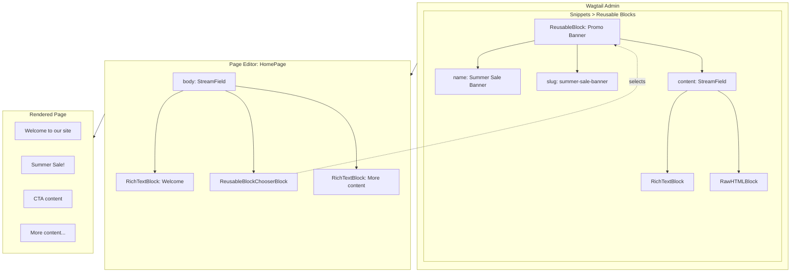
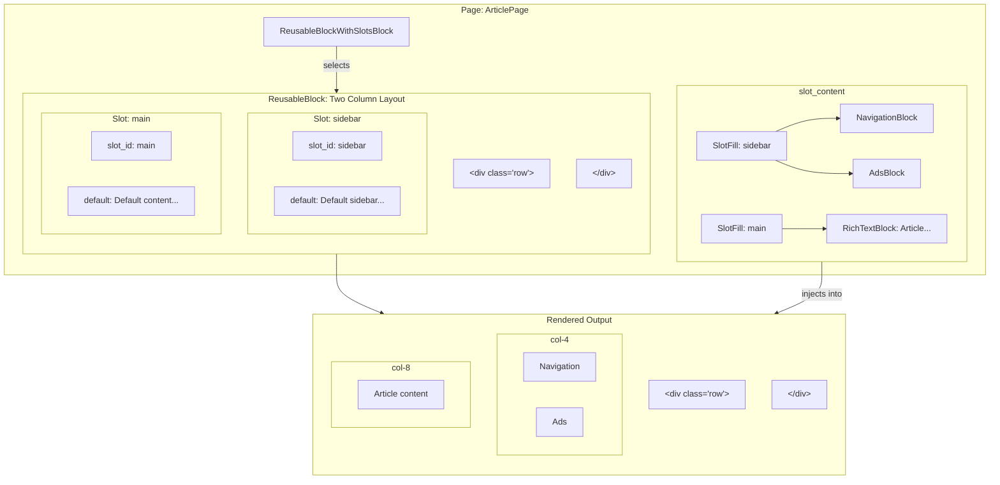
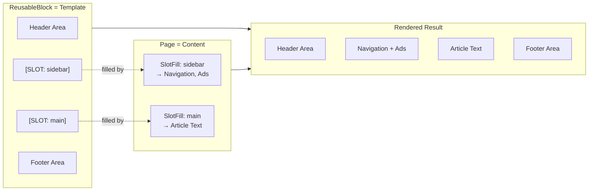
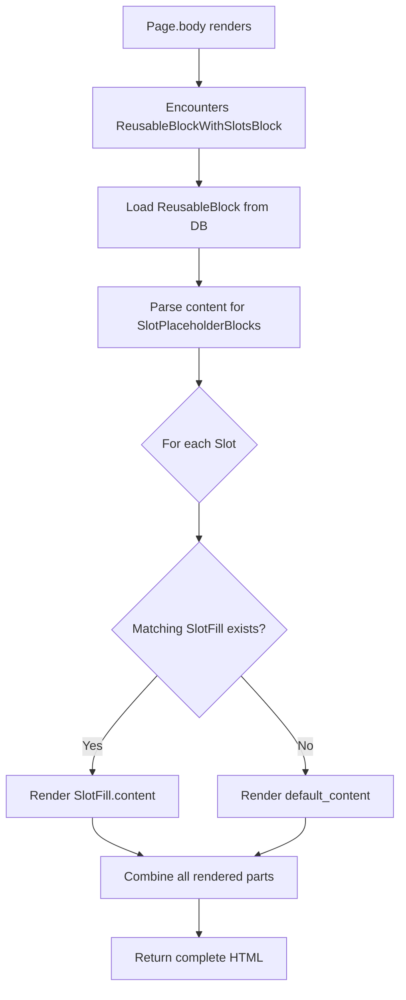
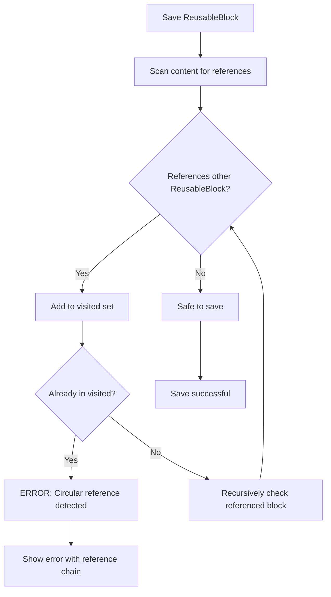
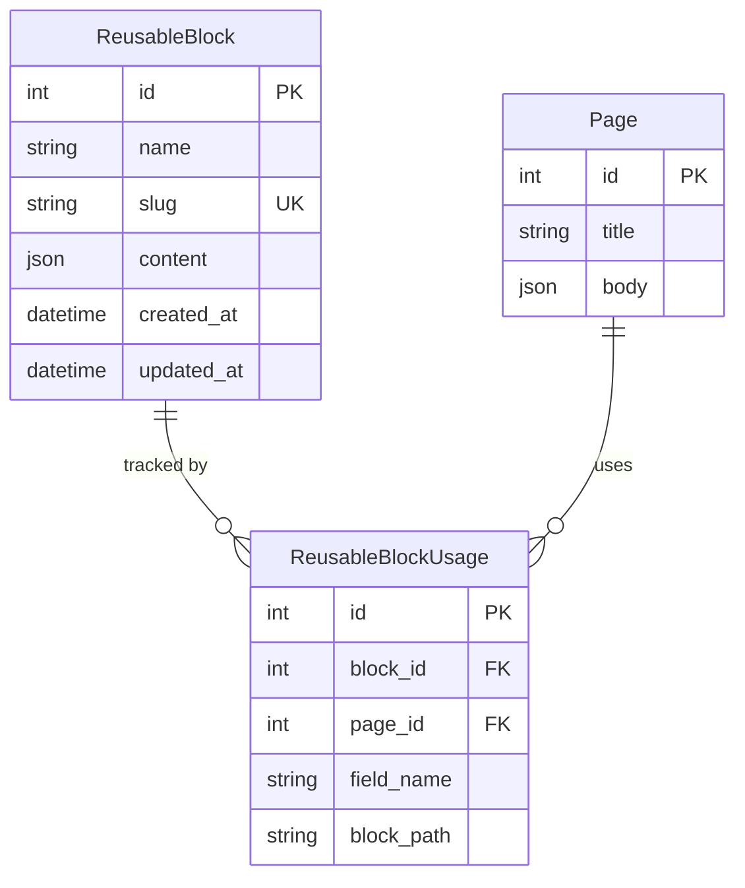
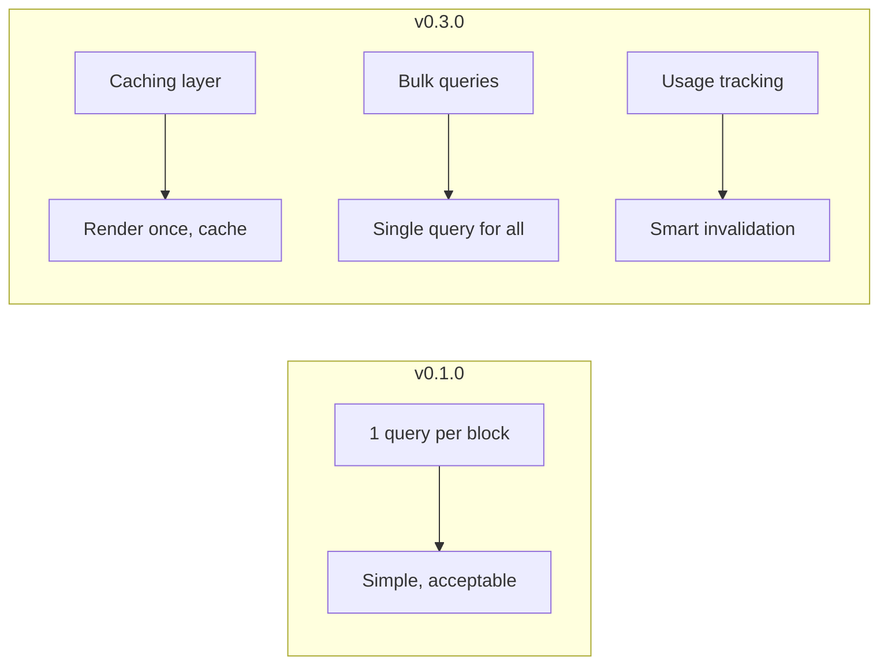

# Architecture & Design Decisions

This document explains the architectural decisions and the "why" behind them. Read this when you return to the project after a long break.

## The Problem We're Solving

### Current Wagtail Limitations

1. **Snippets are too simple**: They store data but don't support full StreamField rendering in pages
2. **Page blocks are not reusable**: Copy/paste requires manual updates everywhere
3. **No single source of truth**: Same content duplicated across pages gets out of sync

### What Users Want

> "I want to create a promotional banner once, use it on 50 pages, and when I update it, all 50 pages update automatically."

## Core Architecture

### Phase 1: Reusable Blocks (v0.1.0)



**Key Decision: Use SnippetChooserBlock pattern**

- Wagtail already has `SnippetChooserBlock` for choosing snippets
- We extend this pattern with custom rendering logic
- Familiar to Wagtail developers

### Phase 2: Slot System (v0.2.0)



**Slot Concept Visualization**



**Key Decision: Slots are StreamField blocks, not template tags**

Why not Django template tags?
- Template tags require code deployment
- Our goal is **no-deploy content changes**
- StreamField blocks can be managed in admin

**Key Decision: Store slot content in the page, not in the ReusableBlock**

- ReusableBlock defines the structure (template)
- Page defines the content for each slot
- This allows same layout with different content per page

## Data Flow

### Rendering a ReusableBlock with Slots



### Circular Reference Detection



**Key Decision: Detect at save time, not render time**

- Fail fast: catch errors when editor saves
- Better UX: clear error message with reference chain
- Performance: no runtime overhead

## Model Relationships



## Why Not Use Existing Solutions?

| Solution | Problem |
|----------|---------|
| **Wagtail CRX** | Full framework, too heavy for simple use case |
| **Snippets + SnippetChooserBlock** | Doesn't render StreamField content inline |
| **Django Template Includes** | Requires code deployment, no admin UI |

## Configuration Philosophy

**Principle: Sensible defaults, full customization**

```python
# Minimal setup - works out of the box
INSTALLED_APPS = ['wagtail_reusable_blocks']

# Full customization available
WAGTAIL_REUSABLE_BLOCKS = {
    'BLOCK_TYPES': [...],      # Custom block types
    'CACHE_ENABLED': True,     # Performance
    'MAX_NESTING_DEPTH': 5,    # Safety limit
}
```

## Performance Strategy



## Future Considerations (Not in Scope)

These are intentionally **not** planned:

1. **Visual slot editor**: Complex UI, high maintenance
2. **Real-time collaboration**: Wagtail doesn't support this natively
3. **A/B testing**: Should be separate package
4. **Multi-site**: Adds complexity, can be added later

## Questions This Document Should Answer

When you return to this project, you should be able to answer:

| Question | Answer |
|----------|--------|
| Why did we build this? | Reusable content with single source of truth |
| Why not use Wagtail CRX? | Too heavy, we need lightweight package |
| Why slots? | Enable layout templates without code deployment |
| Why detect circular refs at save time? | Better UX, fail fast |
| Why store slot content in page? | Same layout, different content per page |
