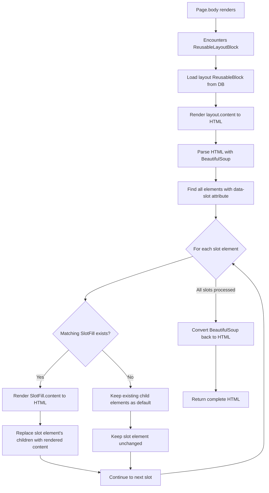
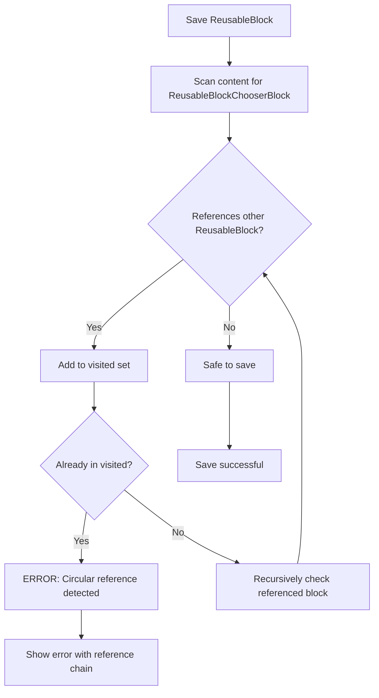
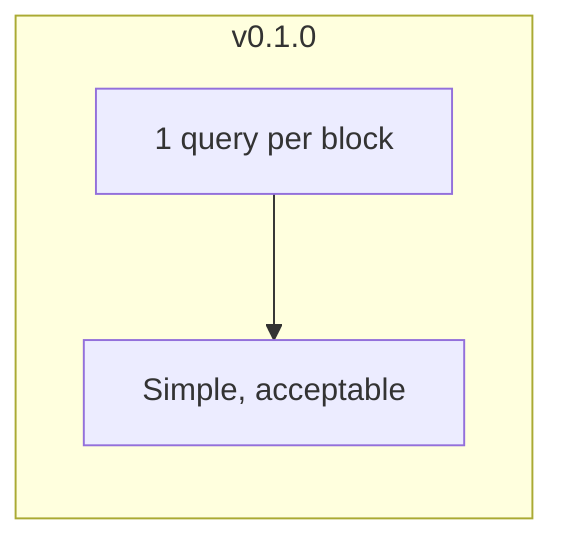

# Architecture & Design Decisions

This document explains the architectural decisions and the "why" behind them. Read this when you return to the project after a long break.

## The Problem We're Solving

### Current Wagtail Limitations

1. **Snippets are too simple**: They store data but don't support full StreamField rendering in pages
2. **Page blocks are not reusable**: Copy/paste requires manual updates everywhere
3. **No single source of truth**: Same content duplicated across pages gets out of sync

### What Users Want

> "I want to create a promotional banner once, use it on 50 pages, and when I update it, all 50 pages update automatically."

## Core Architecture

### Phase 1: Reusable Blocks (v0.1.0)


**Key Decision: Use SnippetChooserBlock pattern**

- Wagtail already has `SnippetChooserBlock` for choosing snippets
- We extend this pattern with custom rendering logic
- Familiar to Wagtail developers

### Phase 2: Slot System (v0.2.0)


**Slot Concept Visualization**


**Key Decision: HTML Attribute-Based Slots**

Why `data-slot` attributes instead of custom block types?

1. **Flexibility** - Designers can write any HTML structure
2. **No code deployment** - Just edit HTML in admin
3. **Standard HTML** - No custom tags, works in any editor
4. **Self-documenting** - `<div data-slot="main"></div>` is clear

**Alternatives considered:**

- **Custom StreamField blocks** - Too rigid, requires code for each slot type
- **Template tags** - Requires code deployment, defeats the purpose
- **Custom XML tags** - Non-standard, poor editor support

**Key Decision: Store slot content in the page, not in the ReusableBlock**

- ReusableBlock defines the structure (template)
- Page defines the content for each slot
- This allows same layout with different content per page

## Data Flow

### Rendering a ReusableLayoutBlock with Slots (v0.2.0)



**Detailed Slot Rendering Flow**

1. **Layout Rendering**: First render the layout block's content as normal HTML
   ```python
   layout_html = self.layout.content.render_as_block()
   ```

2. **HTML Parsing**: Parse the HTML using BeautifulSoup
   ```python
   soup = BeautifulSoup(layout_html, 'html.parser')
   ```

3. **Slot Detection**: Find all elements with `data-slot` attribute
   ```python
   slot_elements = soup.find_all(attrs={settings.SLOT_ATTRIBUTE: True})
   ```

4. **Slot Filling**: For each slot element:
   - Get the `slot_id` from the `data-slot` attribute
   - Find matching `SlotFillBlock` in `slot_content`
   - If found: render the SlotFill's content and replace slot's children
   - If not found: keep existing children as default content

5. **HTML Assembly**: Convert the modified BeautifulSoup object back to HTML

**Performance Characteristics:**

- Slot detection: O(n) where n = number of HTML elements
- Rendering: O(m) where m = number of filled slots
- No database queries during slot filling (all data pre-loaded)

### Circular Reference Detection (v0.1.0 + v0.2.0)

**v0.1.0: ReusableBlockChooserBlock Nesting**



**v0.2.0: Extended for ReusableLayoutBlock**

The circular reference detection in v0.2.0 also checks:

1. **Layout references**: ReusableLayoutBlock → ReusableBlock (layout)
2. **Slot fill references**: SlotFillBlock → ReusableBlockChooserBlock
3. **Nested layout references**: ReusableLayoutBlock in SlotFillBlock

Example of detected circular reference:
```
Layout A (via ReusableLayoutBlock)
└─ slot "content"
   └─ Layout B (via ReusableLayoutBlock, nested)
      └─ slot "main"
         └─ Layout A (via ReusableLayoutBlock) ❌ CIRCULAR!
```

Error message:
```
Circular reference detected: Layout A → Layout B → Layout A
```

**Key Decision: Detect at save time, not render time**

- Fail fast: catch errors when editor saves
- Better UX: clear error message with reference chain
- Performance: no runtime overhead
- Works for both v0.1.0 and v0.2.0 block types

## Model Relationships


## Why Not Use Existing Solutions?

| Solution | Problem |
|----------|---------|
| **Wagtail CRX** | Full framework, too heavy for simple use case |
| **Snippets + SnippetChooserBlock** | Doesn't render StreamField content inline |
| **Django Template Includes** | Requires code deployment, no admin UI |

## Configuration Philosophy

**Principle: Sensible defaults, full customization**

```python
# Minimal setup - works out of the box
INSTALLED_APPS = ['wagtail_reusable_blocks']

# Full customization available
WAGTAIL_REUSABLE_BLOCKS = {
    'BLOCK_TYPES': [...],      # Custom block types
    'MAX_NESTING_DEPTH': 5,    # Safety limit
}
```

## Performance Strategy



For caching, rely on Django's standard caching middleware or template fragment caching.

## Future Considerations (Not in Scope)

These are intentionally **not** planned:

1. **Visual slot editor**: Complex UI, high maintenance
2. **Real-time collaboration**: Wagtail doesn't support this natively
3. **A/B testing**: Should be separate package
4. **Multi-site**: Adds complexity, can be added later

## REST API Layer (v0.8.0)

### Why Two ViewSets?

The library ships two independent ViewSets that serve different audiences:

| ViewSet | Base class | Access | Purpose |
|---------|------------|--------|---------|
| `ReusableBlockAPIViewSet` | `wagtail.api.v2.views.BaseAPIViewSet` | Read-only | Public content delivery for headless / JAMstack front-ends |
| `ReusableBlockModelViewSet` | `rest_framework.viewsets.ModelViewSet` | Full CRUD | Internal tooling, CI pipelines, admin scripts |

**Key Decision: Separate read-only and CRUD concerns**

Merging them into a single ViewSet would force every integrator to reason about write permissions even when only reads are needed. Keeping them separate means:

- Projects that only need public data include `ReusableBlockAPIViewSet` and never expose mutation endpoints.
- Projects that need programmatic management include `ReusableBlockModelViewSet` and configure its permissions independently.
- Each ViewSet can evolve at its own pace without coupling the two use-cases.

### Authentication and Permission Delegation

Neither ViewSet hard-codes authentication or permission logic. Instead, they delegate to the application:

**`ReusableBlockAPIViewSet`** inherits Wagtail API v2's own authentication mechanism, which is already configured in each project's `WAGTAIL_API_*` settings. No additional configuration is needed.

**`ReusableBlockModelViewSet`** reads two optional settings at request time:

```python
WAGTAIL_REUSABLE_BLOCKS = {
    'API_PERMISSION_CLASSES': ['rest_framework.permissions.IsAuthenticated'],
    'API_AUTHENTICATION_CLASSES': None,  # None = use DRF DEFAULT_AUTHENTICATION_CLASSES
}
```

The classes are resolved lazily via `import_string`, so they can be any dotted Python path. Setting `API_AUTHENTICATION_CLASSES` to `None` deliberately falls back to DRF's global `DEFAULT_AUTHENTICATION_CLASSES`, which avoids duplicating configuration that the project already manages.

**Rationale: Do not impose a security model**

This library cannot know whether a project exposes blocks publicly, behind session auth, or via token auth. Delegating to the application via settings means:

- No breaking change when the project changes its auth strategy.
- No need to subclass the ViewSet for a different permission scheme.
- Consistent with how Wagtail itself handles authentication.

### StreamField Serialization

Wagtail's `StreamValue` is not a plain Python list—it is a lazy object that resolves block types at access time. The custom `StreamFieldField` bridges Wagtail and DRF:

```
Read  (to_representation):  StreamValue → stream_block.get_api_representation() → list[dict]
Write (to_internal_value):  list[dict]  → stored as-is in validated_data → assigned to model field
```

**`get_api_representation`** is Wagtail's own method for producing the canonical JSON form of a StreamField (the same format the Wagtail API v2 uses internally). Delegating to it means the serialization format is always in sync with Wagtail's own API, even as block types change.

**Write path**: The raw list from `to_internal_value` is assigned directly to `instance.content`. Wagtail's `StreamField` descriptor handles coercion to `StreamValue` on next access and stores it correctly in the JSON column.

**Slug auto-generation**: When a `name` is supplied but `slug` is omitted (or explicitly set to `""`), the serializer calls `django.utils.text.slugify(name)` and validates uniqueness in the same `validate()` pass. This mirrors the behaviour of the Wagtail admin save handler.

**Revision on save**: Both `create()` and `update()` call `instance.save_revision()` after persisting the model. This ensures every API write is traceable in Wagtail's revision history, exactly as if the change had been made through the admin.

## Questions This Document Should Answer

When you return to this project, you should be able to answer:

| Question | Answer |
|----------|--------|
| Why did we build this? | Reusable content with single source of truth |
| Why not use Wagtail CRX? | Too heavy, we need lightweight package |
| Why slots (v0.2.0)? | Enable layout templates without code deployment |
| Why `data-slot` attributes? | Standard HTML, no code deployment, self-documenting |
| Why BeautifulSoup for parsing? | Robust HTML parsing, handles any HTML structure |
| Why detect circular refs at save time? | Better UX, fail fast with clear error messages |
| Why store slot content in page? | Same layout, different content per page |
| Why JavaScript widget for slots? | Better UX - auto-populated dropdowns instead of text input |
| Why inject slot URL via `insert_global_admin_js`? | Avoids hardcoding `/admin/` prefix; `reverse()` at runtime produces the correct URL regardless of `WAGTAIL_ADMIN_URL_PATH` customization |
| Can v0.1.0 and v0.2.0 coexist? | Yes! Fully backward compatible, use both in same page |
| Why two ViewSets for API (v0.8.0)? | Separate read-only (public delivery) from CRUD (internal tooling) concerns |
| Why delegate auth to the application? | Library cannot know each project's security model; settings-based delegation avoids hard-coding |
| Why use `get_api_representation` for StreamField? | Delegates to Wagtail's own canonical serialization so output stays in sync with the Wagtail API v2 format |
| Why call `save_revision()` on API write? | Keeps every API change traceable in Wagtail's revision history, same as admin saves |
